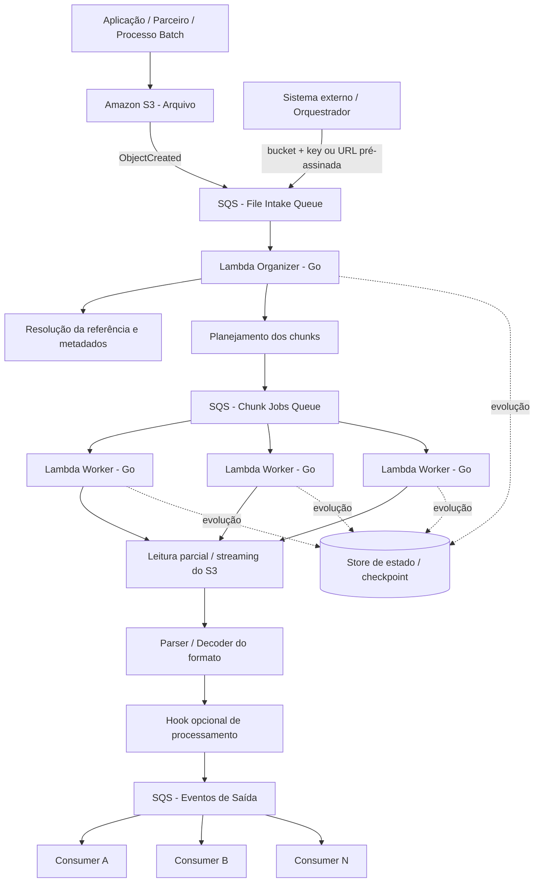
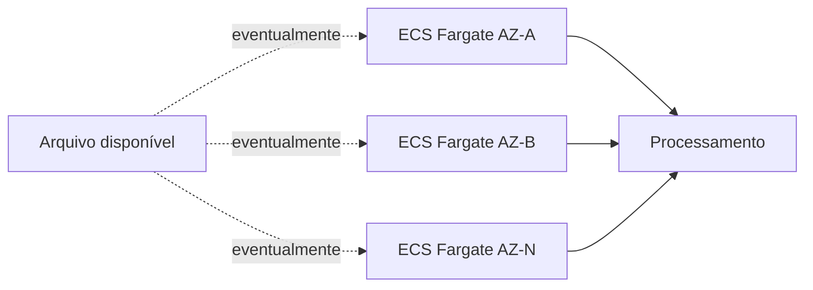
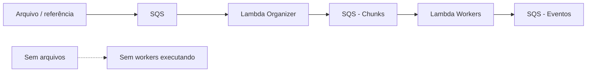
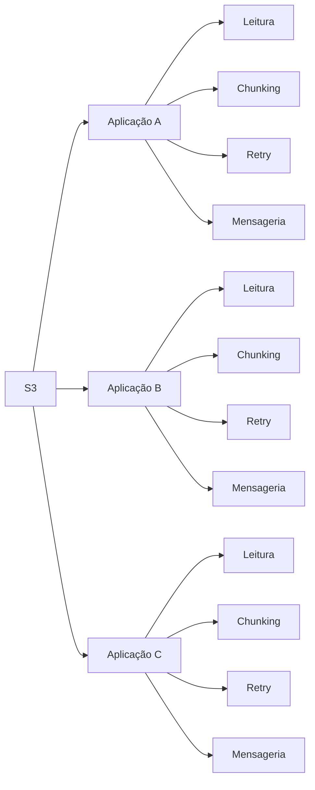
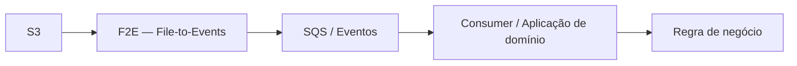

# Blueprint Arquitetural — F2E (File-to-Events) em Go

## Resumo executivo

O **F2E — File-to-Events** é uma proposta de framework em **Go** para transformar arquivos potencialmente grandes em unidades menores de processamento e, ao final, em eventos publicados em **Amazon SQS**.

A solução cria uma fronteira entre integrações orientadas a **arquivos / batch** e arquiteturas **Event-Driven**, abstraindo das aplicações consumidoras preocupações técnicas recorrentes como leitura eficiente de arquivos grandes, streaming, chunking, paralelismo, controle de concorrência, publicação em lotes, rastreabilidade e futura recuperação por checkpoint.

O F2E pode ser acionado por mais de um mecanismo de entrada:

- evento originado pela criação de um objeto em **Amazon S3**;
- mensagem recebida por **Amazon SQS** contendo a referência do arquivo;
- mensagem SQS contendo uma **URL pré-assinada do S3**, permitindo que a solução processe um objeto sem depender diretamente de um evento `ObjectCreated` do bucket.

O principal ganho operacional esperado é substituir cenários em que aplicações dedicadas permanecem executando continuamente apenas para aguardar a chegada eventual de arquivos. No cenário atual considerado como referência, existem workloads em **ECS Fargate executando 24x7 e distribuídos em múltiplas Availability Zones**, embora grande parte do tempo permaneçam ociosos. Com o uso de **AWS Lambda**, a capacidade computacional é acionada somente quando existe trabalho a executar e escala de acordo com a quantidade de chunks, reduzindo a necessidade de manter compute permanentemente provisionado.

A solução pode ser utilizada em dois níveis:

1. **File splitter / eventizer técnico:** o framework apenas lê, divide e converte registros em eventos, deixando toda a regra de negócio para os consumidores downstream.
2. **Pipeline extensível:** a aplicação que incorpora o framework pode adicionar validações, filtros, enriquecimentos ou transformações de negócio antes da publicação no SQS, mantendo essas regras como extensões da solução específica e não como responsabilidade do core do framework.

O F2E não pretende substituir uma arquitetura Event-Driven completa. Permanecem fora do seu core responsabilidades como persistência de domínio, consistência transacional entre sistemas consumidores, idempotência funcional ponta a ponta, governança downstream, regras finais de negócio, retenção de dados de domínio e processos funcionais de replay.

### Benefícios esperados

- reduzir infraestrutura dedicada e ociosa;
- utilizar processamento sob demanda;
- transformar arquivos grandes em unidades pequenas e paralelizáveis;
- padronizar ingestão de arquivos;
- reduzir duplicação de código entre aplicações;
- facilitar evolução de leiautes e parsers;
- desacoplar consumidores do formato físico do arquivo;
- permitir controle explícito de throughput e concorrência;
- criar rastreabilidade entre arquivo, chunk e evento;
- oferecer uma base reutilizável para diferentes domínios.

### Decisão tecnológica resumida — Go

A implementação de referência do F2E é proposta em **Go**. A escolha não pressupõe que Go seja universalmente superior a Java ou Python; ela é direcionada ao perfil deste workload: Lambdas pequenas, orientadas a eventos, com leitura intensiva de S3, parsing incremental, concorrência de I/O e publicação em SQS.

A hipótese arquitetural é que Go permita executar esse caminho crítico com **menor overhead de runtime, inicialização simples e menor pressão de memória**, favorecendo funções menores e processamento eficiente por unidade de recurso. Como o custo e a CPU da AWS Lambda estão relacionados à memória configurada e à duração da execução, essa vantagem deve ser comprovada por benchmarks representativos antes da adoção corporativa.

---


## 1. Objetivo deste documento

Este documento apresenta, em nível arquitetural, uma proposta de componente reutilizável denominado **F2E — File-to-Events**, destinado a **transformar arquivos acessíveis no Amazon S3 em eventos processáveis por sistemas downstream**.

A solução é pensada para execução serverless na AWS, com **AWS Lambda em Go**, processamento distribuído por chunks e uso de **Amazon SQS** como mecanismo de desacoplamento e controle de carga. O arquivo pode ser descoberto diretamente por eventos do S3 ou informado por mensageria, inclusive por meio de uma URL pré-assinada para acesso ao objeto.

O objetivo não é definir todos os detalhes de implementação, mas estabelecer:

- qual problema a solução resolve;
- onde começa e termina sua responsabilidade;
- quais camadas arquiteturais ela simplifica;
- quais responsabilidades continuam pertencendo aos sistemas consumidores;
- como o processamento pode evoluir de arquivos de leiaute fixo para formatos mais complexos;
- quais trade-offs precisam ser discutidos antes de transformar a ideia em uma solução corporativa reutilizável.

---

# 2. Problema que a solução pretende resolver

Diversos sistemas ainda recebem grandes volumes de dados na forma de arquivos.

Exemplos:

- arquivos batch de integração;
- cargas legadas;
- arquivos regulatórios;
- arquivos de parceiros;
- exportações de sistemas externos;
- processamento de milhões de registros em lote.

O problema recorrente é que cada aplicação acaba implementando novamente mecanismos como:

```text
receber arquivo
      |
      v
identificar o leiaute
      |
      v
abrir / fazer streaming
      |
      v
dividir o arquivo
      |
      v
controlar paralelismo
      |
      v
recuperar registros
      |
      v
publicar eventos
      |
      v
controlar erros e progresso
```

A proposta é retirar essa responsabilidade das aplicações de negócio e tratá-la como uma **capacidade de plataforma / biblioteca reutilizável**.

Além da duplicação técnica, existe um problema operacional importante no cenário atual: processadores dedicados podem permanecer executando continuamente em ECS Fargate, inclusive em múltiplas Availability Zones, mesmo quando não existe arquivo a processar. O F2E busca também substituir esse padrão, quando adequado, por processamento serverless acionado somente pela existência de trabalho.

A aplicação downstream deixa de pensar em "arquivo" e passa a pensar em **eventos ou registros independentes**.

---

# 3. Visão arquitetural da solução

## 3.1 Papel principal

A solução atua como uma ponte entre dois modelos de integração:

```text
Arquivo / Batch
      |
      v
F2E — File-to-Events
      |
      v
Mensageria / Event-Driven
```

A entrada pode ocorrer tanto por um evento gerado pelo próprio S3 quanto por uma mensagem externa que informe onde o arquivo está localizado. Isso permite utilizar o framework em integrações nas quais o bucket pertence à própria solução ou em fluxos nos quais outro sistema apenas entrega uma referência de acesso ao arquivo.

Seu papel é transformar um artefato grande e pouco granular — o arquivo — em unidades menores de processamento que possam ser consumidas de forma assíncrona e escalável.

## 3.2 Escolha de linguagem — por que Go para a implementação de referência

A escolha de Go é orientada pelo perfil operacional do F2E, e não apenas por preferência tecnológica.

O caminho crítico de um worker é predominantemente:

```text
SQS
 |
 v
S3 Range / Stream
 |
 v
buffer / parser
 |
 v
transformação opcional
 |
 v
SQS batch
```

Esse fluxo possui forte componente de **I/O**, mas também pode executar parsing, validações e transformações em milhões de registros. Por isso, interessam simultaneamente:

- baixo consumo de memória;
- baixa sobrecarga de runtime;
- inicialização rápida;
- concorrência simples para sobrepor operações de rede;
- throughput previsível;
- empacotamento pequeno e simples;
- capacidade de aproveitar ambientes Lambda reutilizados;
- custo por unidade processada.

### 3.2.1 Relação entre memória, CPU e custo na Lambda

Na AWS Lambda, memória e CPU não são dimensões completamente independentes.

A AWS aloca capacidade de CPU proporcionalmente à memória configurada. Portanto:

```text
menos memória
     |
     +--> menor custo por unidade de tempo
     |
     +--> também menos CPU disponível
```

Consequentemente, a decisão correta não é simplesmente executar a Lambda com a menor memória possível.

O objetivo é encontrar o ponto de melhor:

```text
custo
  x
duração
  x
throughput
```

Uma implementação com menor overhead de runtime pode permitir atingir o throughput necessário com uma configuração menor de memória. Porém, isso precisa ser medido: reduzir memória demais pode aumentar o tempo total de execução e eliminar a economia pretendida.

No F2E, o benchmark deve comparar **custo por GB processado**, **custo por milhão de registros** e **tempo total do job**, e não apenas duração isolada de uma invocação.

### 3.2.2 Go

Go compila para código nativo e, no Lambda, pode ser implantado como um único executável utilizando o runtime OS-only `provided.al2023`.

Características relevantes para o F2E:

- não exige inicialização de JVM;
- não depende de um interpretador da linguagem durante a execução;
- não possui etapa de JIT para atingir sua performance normal;
- tende a possuir footprint de memória reduzido para workers pequenos;
- possui modelo de concorrência leve baseado em goroutines;
- possui APIs idiomáticas para streaming por meio de `io.Reader`;
- facilita sobrepor leitura S3, parsing e publicação SQS sem criar uma arquitetura interna pesada;
- gera artefato de deploy simples;
- possui AWS SDK oficial para Go.

Para este projeto, a ausência de JIT é particularmente interessante: não é necessário manter o processo executando por longos períodos para que o runtime alcance um estado otimizado de execução.

Mesmo em Go, existe uma fase de inicialização da Lambda. Clientes AWS, configuração, estruturas estáticas e outras dependências devem ser criados fora do handler sempre que puderem ser reutilizados.

```text
Cold environment
      |
      v
inicializa runtime + aplicação
      |
      v
Invoke
      |
      v
ambiente pode ser reutilizado
      |
      +--> Invoke
      +--> Invoke
      +--> Invoke
```

A reutilização do ambiente beneficia todas as linguagens. Em Go, entretanto, o objetivo é manter pequena a quantidade de trabalho necessária antes do primeiro processamento.

### 3.2.3 Java

Java continua sendo uma alternativa tecnicamente forte, principalmente em ambientes corporativos com grande ecossistema Java.

Depois de inicializada, a JVM pode entregar excelente throughput e o JIT pode otimizar caminhos executados com frequência. Além disso, a AWS oferece mecanismos específicos para reduzir impacto de inicialização, principalmente **Lambda SnapStart** para runtimes Java suportados.

O trade-off para o F2E aparece principalmente quando a aplicação incorpora frameworks completos como Spring Boot.

O cold start pode envolver:

```text
inicialização da JVM
       |
       v
class loading
       |
       v
framework bootstrap
       |
       v
dependency injection
       |
       v
inicialização de clients / beans
       |
       v
handler disponível
```

Esse custo é muito menos relevante em serviços ECS que permanecem ativos por horas ou dias, porque ocorre poucas vezes durante a vida do processo. Em Lambda, novos execution environments podem ser criados durante períodos de inatividade ou durante aumento de concorrência.

O **SnapStart** reduz significativamente essa desvantagem ao inicializar a função previamente e restaurar snapshots do ambiente. Portanto, a decisão Go versus Java não deve ser baseada somente em cold start.

Para o F2E, os argumentos adicionais em favor de Go são:

- evitar carregar uma plataforma de aplicação maior do que o worker necessita;
- reduzir overhead de memória de JVM/framework quando o código executado é essencialmente infraestrutura de streaming;
- simplificar concorrência de I/O;
- reduzir quantidade de abstrações necessárias para um worker pequeno;
- obter um executável com comportamento de performance mais uniforme desde o início da execução.

Java pode continuar sendo preferível quando:

- o domínio depende fortemente de bibliotecas Java corporativas;
- há necessidade de reutilizar componentes Spring existentes;
- produtividade e suporte interno superam uma possível economia de runtime;
- o processamento é CPU-intensive e longo o suficiente para aproveitar otimizações da JVM;
- benchmarks mostrarem custo equivalente ou melhor.

### 3.2.4 Python

Python é uma alternativa muito forte para Lambdas pequenas, automações e integrações devido à velocidade de desenvolvimento e ao amplo ecossistema AWS.

Para funções simples e predominantemente de I/O, Python pode entregar resultado suficiente e possuir startup competitivo. A própria AWS também oferece SnapStart para versões Python gerenciadas suportadas.

A escolha de Go para o core do F2E ocorre por outro motivo: o F2E pretende ser uma infraestrutura reutilizável que pode executar continuamente parsing e transformação sobre milhões de registros durante cada job.

Nesse contexto, Go oferece:

- execução compilada nativamente;
- tipagem estática para contratos do framework;
- concorrência leve sem exigir um modelo assíncrono espalhado pela API pública;
- menor overhead de execução em loops de parsing e transformação;
- controle explícito de buffers e alocações;
- facilidade para construir pipelines de streaming com back-pressure interno.

Python pode ser preferível quando:

- o volume é baixo;
- o tempo de desenvolvimento é o principal fator;
- existe forte dependência de bibliotecas Python;
- o processamento é simples e o custo do runtime não é material;
- o time possui maior maturidade operacional em Python.

### 3.2.5 Warm execution e reaproveitamento do ambiente

É importante separar dois conceitos:

**Cold start**

```text
criar execution environment
        +
inicializar runtime
        +
inicializar aplicação
```

**Warm invocation**

```text
execution environment existente
        |
        v
novo evento
        |
        v
handler
```

A AWS pode reutilizar o mesmo execution environment em invocações posteriores. Isso permite reutilizar:

- clientes do AWS SDK;
- configurações já carregadas;
- estruturas imutáveis;
- pools e conexões apropriadas;
- conteúdo temporário em `/tmp`, quando aplicável.

No F2E, clients S3 e SQS devem ser inicializados fora do handler para aproveitar essa reutilização.

Em Java, warm execution também elimina grande parte do custo de bootstrap e permite aproveitar a JVM já inicializada. Em Python, imports e objetos globais também podem ser reutilizados. Portanto, **warm start não é uma vantagem exclusiva de Go**.

A vantagem esperada de Go está principalmente no custo e simplicidade do ambiente quando uma nova instância precisa ser criada e no overhead durante o processamento sustentado.

### 3.2.6 Concorrência interna do worker

O workload do F2E tende a esperar por rede em diferentes pontos:

```text
GET / Range S3
       |
       v
processamento
       |
       v
SendMessageBatch SQS
```

Go permite usar goroutines para sobrepor essas etapas com uma quantidade pequena e controlada de concorrência.

Exemplo conceitual:

```text
         +--> reader S3 --------+
         |                      |
chunk ---+--> parser -----------+--> batches
         |                      |
         +--> publisher SQS ----+
```

O objetivo não é criar concorrência ilimitada.

A quantidade de goroutines, buffers e streams simultâneos deve ser controlada para evitar:

- aumento desnecessário de memória;
- excesso de conexões;
- throttling;
- pressão sobre SQS;
- redução de previsibilidade do worker.

Essa característica é relevante na escolha de Go porque o modelo de concorrência da linguagem é simples para workloads I/O-bound e pode ser encapsulado pelo framework sem expor sua complexidade aos consumidores.

### 3.2.7 Comparação resumida

| Critério | Go | Java / Spring Boot | Python |
|---|---|---|---|
| Modelo de execução | Código nativo compilado | JVM + bytecode/JIT | Runtime interpretado/dinâmico |
| Overhead de runtime | Baixo | Maior, especialmente com framework | Baixo a moderado dependendo das dependências |
| Cold start esperado | Favorável para binários pequenos | Pode ser relevante; SnapStart reduz o impacto | Geralmente favorável; SnapStart disponível em runtimes suportados |
| Warm execution | Muito eficiente | Muito eficiente e pode aproveitar JIT | Eficiente para workloads de I/O |
| Footprint de memória | Tendencialmente baixo | Tendencialmente maior com JVM/Spring | Pode ser baixo, mas varia com dependências |
| Concorrência I/O | Goroutines / channels | Threads, executors, virtual threads e APIs async | Async I/O / threads conforme workload |
| Parsing intensivo | Bom | Bom / muito bom após warmup | Adequado, mas com maior overhead por operação em muitos cenários |
| Empacotamento | Executável único | JAR / dependências / runtime gerenciado | Código + dependências |
| Ecossistema corporativo | Menor que Java | Muito forte | Muito forte em automação e dados |
| Curva para equipes Java | Maior | Menor | Intermediária |
| Adequação ao F2E | **Alta** | Alta, com maior footprint potencial | Alta para soluções simples; deve ser medida para alto volume |

Os termos “baixo”, “alto” e “favorável” nesta tabela representam **tendências arquiteturais**, não garantias de performance.

### 3.2.8 Hipótese econômica

O racional de economia esperado é:

```text
runtime mais enxuto
       |
       v
possibilidade de menor memória configurada
       |
       v
menor custo por milissegundo
       |
       +
boa performance de parsing / streaming
       |
       v
menor ou equivalente duração
       |
       v
menor custo por unidade processada
```

A hipótese só é válida quando:

```text
economia de memória
        >
eventual aumento de duração
```

Por isso, não é recomendável apresentar antecipadamente um percentual fixo de economia entre Go, Java e Python.

### 3.2.9 Benchmark obrigatório antes da padronização

Antes de transformar Go em decisão corporativa do F2E, a recomendação é executar a mesma carga com implementações equivalentes.

Matriz mínima:

```text
Linguagem:
  Go
  Java
  Python

Arquitetura:
  arm64
  x86_64

Memória:
  múltiplos níveis representativos

Carga:
  mesmo arquivo
  mesmo tamanho de chunk
  mesma quantidade de registros
  mesmo destino SQS
```

Medir:

- Init Duration;
- Duration;
- Max Memory Used;
- bytes processados por segundo;
- registros processados por segundo;
- custo estimado por GB;
- custo estimado por milhão de eventos;
- taxa de erros;
- tempo total do arquivo;
- quantidade de cold starts;
- throughput do S3;
- throughput de publicação SQS.

O resultado desse benchmark deve decidir o sizing final.

Isso também evita uma falsa otimização: uma função Go configurada com pouca memória pode receber menos CPU e demorar mais; uma Java com mais memória pode terminar muito mais rápido; uma Python pode ser suficiente porque o gargalo real está integralmente na rede.

A linguagem deve ser escolhida pelo **custo total para processar a carga real**, e não apenas pelo consumo de RAM observado.

### 3.2.10 Trade-offs da escolha de Go

A decisão também possui custos:

- Go utiliza runtime OS-only no Lambda, em vez de um runtime gerenciado específico da linguagem;
- SnapStart não se aplica aos runtimes OS-only;
- atualizações da versão do compilador Go e de dependências fazem parte do ciclo de build da aplicação;
- pode existir menor maturidade interna quando comparado ao ecossistema Java/Spring;
- bibliotecas e padrões corporativos existentes em Java podem precisar de equivalentes em Go;
- treinamento e suporte do time devem ser considerados no custo total da solução.

Portanto, a decisão arquitetural proposta é:

> **adotar Go como implementação de referência do F2E por sua aderência ao perfil de streaming, concorrência e eficiência de recursos, mas validar a vantagem econômica por benchmark e manter a arquitetura desacoplada o suficiente para que a decisão possa ser revista caso dados reais indiquem outra alternativa.**

### 3.2.11 Referências técnicas AWS

- [Building Lambda functions with Go](https://docs.aws.amazon.com/lambda/latest/dg/lambda-golang.html)
- [Go em Amazon Linux 2023 / `provided.al2023`](https://docs.aws.amazon.com/linux/al2023/ug/go.html)
- [Configuração de memória e CPU da AWS Lambda](https://docs.aws.amazon.com/lambda/latest/dg/configuration-memory.html)
- [Lifecycle do execution environment e cold start](https://docs.aws.amazon.com/lambda/latest/dg/lambda-runtime-environment.html)
- [AWS Lambda best practices — reutilização do execution environment](https://docs.aws.amazon.com/lambda/latest/dg/best-practices.html)
- [Lambda SnapStart](https://docs.aws.amazon.com/lambda/latest/dg/snapstart.html)
- [Otimização de startup do AWS SDK for Java em Lambda](https://docs.aws.amazon.com/sdk-for-java/latest/developer-guide/lambda-optimize-starttime.html)

---

# 4. Visão macro da arquitetura

O F2E admite duas formas principais de entrada.

### Entrada A — evento originado pelo S3

```text
Upload no S3
     |
     v
evento de criação
     |
     v
SQS - File Intake
```

### Entrada B — referência recebida por SQS

```text
Sistema de origem
     |
     v
SQS - File Intake
     |
     +--> bucket + key
     |
     +--> URL pré-assinada do S3
```

Ambos os caminhos convergem para o mesmo mecanismo de planejamento e processamento.



A **URL pré-assinada** funciona como uma alternativa de acesso ao arquivo. Nesse modo, o produtor da mensagem controla o acesso temporário ao objeto e o F2E recebe apenas a referência necessária para processá-lo.

---

# 5. Responsabilidade da solução

A solução deve ser responsável por:

- identificar o arquivo a ser processado, independentemente de a referência chegar por evento S3 ou por SQS;
- resolver a forma de acesso ao objeto, incluindo `bucket/key` ou URL pré-assinada quando aplicável;
- obter seus metadados;
- determinar a estratégia de divisão;
- gerar unidades de trabalho independentes;
- controlar a distribuição dessas unidades;
- ler o conteúdo de forma incremental, evitando materializar o arquivo inteiro em memória;
- interpretar os limites de registros conforme o formato;
- transformar registros em eventos;
- disponibilizar hooks opcionais para validação, filtragem, enriquecimento ou transformação específica da aplicação;
- publicar os eventos no mecanismo de mensageria configurado;
- fornecer metadados de rastreabilidade entre arquivo, chunk e evento;
- permitir evolução futura para checkpoint, retry granular e replay parcial;
- fornecer observabilidade técnica do processamento.

---

# 6. Responsabilidades que ficam fora da solução

O **core do framework não deve possuir regra de negócio de domínio**.

Entretanto, por ser um framework incorporado pela aplicação, ele pode disponibilizar pontos de extensão para que o domínio execute lógica específica **antes da publicação do evento**, por exemplo:

- filtragem de registros;
- validações específicas;
- enriquecimento;
- normalização;
- transformação do payload;
- cálculo de atributos necessários ao evento.

Essas regras pertencem à aplicação que utiliza o framework, e não ao core reutilizável do F2E.

A regra de negócio final associada ao consumo e à mudança de estado do domínio continua fora do escopo.

Ficam fora do seu escopo:

- validação de regras de negócio do domínio;
- persistência de domínio;
- tomada de decisão funcional;
- processamento downstream;
- idempotência final dos consumidores;
- geração de novos eventos de domínio após processamento;
- governança dos consumidores;
- consistência transacional entre sistemas downstream;
- tratamento funcional de registros inválidos;
- retenção histórica dos dados de negócio.

O componente deve entregar um registro tecnicamente processável e rastreável, mas não assumir responsabilidades pertencentes ao domínio consumidor.

---

# 7. Fluxo completo e posição do componente

| Etapa | Responsabilidade | F2E — File-to-Events |
|---|---|---|
| Produção do arquivo | Sistema de origem gera o arquivo | Não |
| Disponibilização do arquivo | Objeto fica acessível no S3 | Não |
| Detecção da chegada | Evento S3 ou mensagem SQS com referência ao arquivo | Sim |
| Planejamento | Arquivo é dividido em unidades de trabalho | Sim |
| Scheduling | Chunks são distribuídos aos workers | Sim |
| Leitura do arquivo | Streaming / leitura parcial do S3 | Sim |
| Parsing técnico | Separação de registros conforme formato | Sim |
| Transformação técnica | Registro vira evento | Sim |
| Extensão de negócio antes da publicação | Filtro / validação / enriquecimento configurado pela aplicação | Opcional |
| Publicação | Evento é enviado para SQS | Sim |
| Regra de negócio | Consumer interpreta o evento | Não |
| Persistência de domínio | Consumer altera estado de negócio | Não |
| Idempotência final | Consumer evita duplicidade funcional | Não |
| Novos eventos de domínio | Sistemas downstream publicam novos eventos | Não |
| Observabilidade técnica | Métricas, logs e tracing do processamento | Sim |
| Observabilidade ponta a ponta | Correlação até os consumidores finais | Compartilhada |

---

# 8. Unidade de trabalho e paralelismo

A principal decisão arquitetural é deixar de tratar o arquivo inteiro como unidade de execução.

```text
Arquivo
  |
  v
Plano de processamento
  |
  +--> Chunk 0
  +--> Chunk 1
  +--> Chunk 2
  +--> ...
  +--> Chunk N
```

Cada chunk deve ser uma unidade de trabalho independente sempre que o formato permitir.

Exemplo conceitual:

```json
{
  "jobId": "job-123",
  "chunkId": 42,
  "bucket": "input-bucket",
  "key": "arquivo.dat",
  "startByte": 5368709120,
  "endByte": 5502926847,
  "format": "fixed-width"
}
```

Isso permite desacoplar:

```text
quantidade de dados
        !=
quantidade de Lambdas simultâneas
```

É possível gerar milhares de chunks e limitar a concorrência dos workers conforme custo, throughput e capacidade dos sistemas downstream.

---

# 9. Processamento em streaming

O worker não deve carregar seu chunk inteiro em memória para depois iniciar o processamento.

O modelo desejado é um pipeline incremental:

```text
S3 Range / Stream
       |
       v
buffer pequeno
       |
       v
identificação de registros
       |
       v
batch de eventos
       |
       v
SQS
```

Isso reduz:

- necessidade de memória da Lambda;
- latência até o primeiro evento;
- impacto do tamanho do chunk;
- risco de falha por falta de memória.

Também permite sobrepor operações de I/O e processamento interno.

---

# 10. Comparação com o modelo atual baseado em ECS Fargate

Um dos cenários que motiva a proposta é a existência de processadores de arquivo executados continuamente em **ECS Fargate**.

Modelo atual de referência:



Características desse modelo:

- tasks permanecem ativas 24x7;
- capacidade é distribuída em múltiplas Availability Zones para atender requisitos de disponibilidade;
- CPU e memória ficam provisionadas mesmo quando não existem arquivos;
- o custo de compute existe durante períodos ociosos;
- scaling e sizing precisam considerar picos futuros;
- a aplicação precisa permanecer operacional apenas para aguardar a próxima unidade de trabalho.

No modelo proposto:



A principal mudança é:

```text
compute permanentemente provisionado
                |
                v
        ECS Fargate 24x7

                versus

trabalho disponível -> compute executa
sem trabalho        -> compute não executa
                |
                v
             Lambda
```

## 10.1 Benefícios esperados em relação ao modelo atual

- redução de compute ocioso;
- pagamento de processamento principalmente quando existe trabalho;
- elasticidade baseada no backlog da fila;
- menor necessidade de dimensionar previamente quantidade fixa de workers;
- isolamento natural entre recebimento do arquivo e velocidade de processamento;
- possibilidade de limitar concorrência sem manter workers permanentes;
- escalabilidade por chunk em vez de por task continuamente ativa;
- redução da responsabilidade operacional relacionada ao ciclo de vida dos containers de processamento.

Isso não significa que Lambda seja superior ao ECS Fargate para qualquer workload. Processamentos contínuos, muito longos, com requisitos específicos de runtime ou utilização constante de CPU podem continuar favorecendo containers. O benefício do F2E é particularmente forte quando a carga é **esporádica, orientada à chegada de arquivos e com períodos relevantes de ociosidade**.

---

# 11. Camadas arquiteturais simplificadas

Sem uma solução comum, cada sistema consumidor pode precisar implementar:

```text
S3 client
leitura de arquivos grandes
range requests
buffering
paralelismo
chunk boundaries
parsing técnico
retry de leitura
publicação SQS
batch de mensagens
correlationId
métricas
controle de timeout
checkpoint
reprocessamento
```

A proposta é concentrar essas preocupações em uma camada reutilizável.

## 11.1 Antes



Cada solução repete infraestrutura técnica semelhante.

## 11.2 Depois



As aplicações passam a concentrar-se principalmente em sua lógica de domínio.

---

# 12. O que ainda precisa existir no sistema antes da solução

Antes do F2E — File-to-Events, continuam necessários:

- uma origem capaz de produzir o arquivo;
- um objeto acessível no S3, que pode estar em bucket diretamente integrado ao F2E ou ser disponibilizado por referência externa;
- quando a integração utilizar URL pré-assinada, um produtor responsável por gerar e enviar essa URL dentro de sua janela de validade;
- definição do contrato do arquivo;
- identificação do formato / leiaute esperado;
- definição de quem pode depositar arquivos;
- mecanismos de segurança e autorização;
- definição de retenção e lifecycle dos arquivos;
- configuração de quais arquivos devem ser processados;
- contrato da mensagem de entrada, incluindo a estratégia utilizada para localizar e acessar o arquivo.

Em cenários corporativos também pode ser necessário um catálogo ou configuração contendo informações como:

```text
formato
versão do leiaute
encoding
record type
tamanho do registro
parser associado
schema do evento de saída
```

---

# 13. O que ainda precisa existir depois da solução

Após os eventos serem produzidos, continuam necessários:

- consumidores downstream;
- lógica de negócio;
- validação funcional;
- persistência;
- idempotência de domínio;
- tratamento de eventos rejeitados;
- estratégia de DLQ downstream;
- monitoramento do backlog das filas;
- observabilidade ponta a ponta;
- eventual publicação de novos eventos de domínio;
- políticas de replay e reprocessamento funcional.

Portanto, a solução reduz complexidade da **ingestão de arquivos**, mas não substitui uma arquitetura Event-Driven completa.

---

# 14. Modelo conceitual das camadas internas

```text
INGESTION
   |
   v
METADATA
   |
   v
PLANNING
   |
   v
SCHEDULING
   |
   v
READING
   |
   v
DECODING / PARSING
   |
   v
EVENT MAPPING
   |
   v
OPTIONAL PROCESSING HOOK
   |
   v
PUBLISHING
```

## 14.1 Ingestion

Identifica que um novo arquivo precisa ser processado.

## 14.2 Metadata

Obtém informações necessárias para planejar o processamento.

## 14.3 Planning

Decide como o arquivo pode ser dividido.

## 14.4 Scheduling

Transforma o plano em jobs independentes para os workers.

## 14.5 Reading

Lê somente a região necessária do arquivo e realiza streaming.

## 14.6 Decoding / Parsing

Transforma bytes em registros técnicos reconhecíveis.

## 14.7 Event Mapping

Transforma um registro em um contrato de evento.

## 14.8 Optional Processing Hook

Ponto de extensão opcional utilizado pela aplicação que incorpora o framework.

Pode executar, por exemplo:

- filtro;
- validação;
- enriquecimento;
- transformação de payload;
- inclusão de atributos de negócio.

O framework define o contrato de extensão; a aplicação é responsável pela lógica executada.

## 14.9 Publishing

Publica os eventos no destino configurado.

---

# 15. Abstração desejada para evolução em Go

A solução pode evoluir para uma biblioteca / framework em que a infraestrutura de processamento seja comum e apenas algumas estratégias variem conforme o formato.

O framework deve permitir dois modos de adoção.

### Modo 1 — somente quebra e publicação

```text
Arquivo
   |
   v
F2E
   |
   +--> leitura
   +--> chunking
   +--> parsing
   +--> event mapping técnico
   |
   v
SQS
```

Nesse modo, o consumidor utiliza o F2E como infraestrutura técnica e mantém toda a lógica funcional depois da fila.

### Modo 2 — pipeline personalizado

```text
Arquivo
   |
   v
F2E Core
   |
   v
Parser
   |
   v
Hook da aplicação
   |
   +--> filtrar
   +--> validar
   +--> enriquecer
   +--> transformar
   |
   v
SQS
```

Nesse modelo, a aplicação incorpora o framework e adiciona comportamento específico antes da publicação.

Isso permite reutilizar o mesmo mecanismo técnico sem obrigar todos os casos de uso a produzirem eventos idênticos ou puramente derivados do registro original.

A separação arquitetural permanece:

> o **framework fornece o mecanismo**; a **aplicação fornece a política de negócio opcional**.

Modelo conceitual:

```text
F2E Core
       |
       +--> Source Resolver
       +--> Split Strategy
       +--> Record Decoder
       +--> Event Mapper
       +--> Optional Processor Hook
       +--> Event Publisher
```

A aplicação específica não deveria precisar conhecer detalhes como:

- paginação / range de S3;
- controle de buffer;
- polling de fila;
- batch de publicação;
- checkpoint técnico;
- correlação entre arquivo e chunk.

Ela deveria fornecer principalmente as estratégias específicas do formato e, quando necessário, a transformação do registro em evento.

---

# 16. Formatos splittable e não splittable

Nem todo formato permite divisão arbitrária por posição de byte.

Por isso, uma evolução importante da arquitetura é classificar formatos pela sua capacidade de particionamento.

## 16.1 Naturalmente splittable

Exemplos:

- registros de tamanho fixo;
- alguns formatos delimitados;
- JSON Lines / NDJSON;
- formatos binários projetados para blocos independentes.

O planner consegue gerar chunks quase diretamente.

## 16.2 Splittable com ajuste de boundary

Exemplos:

- CSV com registros delimitados;
- texto com linhas de tamanho variável.

O chunk começa em uma posição aproximada e o worker precisa localizar o início / fim válido de um registro.

## 16.3 Estruturalmente dependentes

Exemplos:

- XML monolítico;
- JSON contendo um grande array;
- formatos binários dependentes de cabeçalho ou índices internos.

Esses casos podem exigir:

- parser streaming consciente do formato;
- descoberta prévia de boundaries;
- índice intermediário;
- processamento sequencial de determinadas regiões;
- estratégia específica de split.

A abstração deve permitir tratar essas diferenças sem alterar o core da solução.

---

# 17. Garantias e pontos de atenção

A solução deve ser analisada considerando pelo menos os seguintes pontos.

## 17.1 At-least-once

SQS e Lambda trabalham naturalmente com cenários em que uma unidade pode ser entregue novamente.

Portanto, deve-se assumir possibilidade de duplicação.

## 17.2 Idempotência

A camada técnica pode fornecer identificadores determinísticos, por exemplo:

```text
fileId
jobId
chunkId
recordPosition
recordId
```

Entretanto, a idempotência funcional final permanece responsabilidade do consumidor.

## 17.3 Retry

Retry deve ocorrer na menor unidade segura possível.

Idealmente:

```text
falha em um chunk
      |
      v
reprocessar chunk
```

em vez de:

```text
falha em um chunk
      |
      v
reprocessar arquivo inteiro
```

## 17.4 Back-pressure

A fila de chunks desacopla o tamanho do arquivo da quantidade de workers executando simultaneamente.

A fila de saída desacopla a produção de eventos da velocidade dos consumidores finais.

## 17.5 Ordenação

Paralelismo implica que a ordem global dos registros pode ser perdida.

Se ordenação for requisito, ela precisa ser tratada explicitamente no desenho.

## 17.6 Replay

A presença do arquivo original no S3 permite reprocessamento, mas o mecanismo e sua granularidade precisam ser definidos.

---

# 18. Observabilidade mínima esperada

A solução deve permitir responder perguntas como:

- qual arquivo originou determinado evento?;
- qual chunk processou determinado registro?;
- quantos bytes foram processados?;
- quantos registros foram produzidos?;
- quais chunks falharam?;
- quanto tempo cada etapa levou?;
- quantas tentativas ocorreram?;
- qual o backlog das filas?;
- o arquivo foi processado integralmente?;
- existem chunks órfãos ou presos?;

Metadados conceituais:

```text
fileId
jobId
chunkId
recordNumber / byteOffset
correlationId
attempt
workerRequestId
```

---

# 19. Fases propostas de evolução

A evolução deve validar primeiro o mecanismo arquitetural e só depois aumentar a complexidade dos formatos.

## Fase 1 — Arquivo de leiaute fixo

Objetivo:

- validar S3 → SQS → Organizer → Chunk Queue → Workers → Event Queue;
- dividir o arquivo por offsets conhecidos;
- processar registros de tamanho fixo;
- medir throughput, memória e concorrência.

Esse é o cenário mais simples porque os boundaries podem ser calculados matematicamente.

## Fase 2 — Texto delimitado

Adicionar suporte a:

- linhas de tamanho variável;
- CSV / delimitadores;
- ajuste de início e fim de chunk para não quebrar registros.

## Fase 3 — JSON orientado a registros

Priorizar inicialmente formatos naturalmente streaming, como:

- JSON Lines;
- NDJSON.

Depois avaliar JSON monolítico com arrays grandes.

## Fase 4 — XML

Adicionar parser streaming e estratégia de identificação de elementos que representam unidades independentes de negócio.

O planner passa a considerar boundaries estruturais, e não apenas bytes.

## Fase 5 — Formatos binários

Criar estratégias específicas para formatos binários.

A possibilidade de paralelismo dependerá do formato possuir:

- frames;
- blocos;
- offsets;
- índices;
- cabeçalhos independentes.

## Fase 6 — Framework extensível

Transformar os componentes específicos de formato em extensões / estratégias plugáveis.

Exemplo conceitual:

```text
F2E Core
 |
 +--> SourceResolver
 +--> FixedWidthDecoder
 +--> DelimitedDecoder
 +--> JsonDecoder
 +--> XmlDecoder
 +--> BinaryDecoder
 +--> CustomDecoder
 +--> OptionalProcessor
 +--> Publisher
```

Objetivo final:

> permitir que novos formatos sejam adicionados sem alterar o mecanismo de ingestão, scheduling, execução distribuída, observabilidade e publicação.

---

# 20. Evoluções posteriores

Depois de validar os formatos básicos, podem ser avaliadas capacidades adicionais:

- checkpoint por chunk;
- retomada próxima ao timeout da Lambda;
- controle de concorrência por arquivo;
- prioridade de jobs;
- DLQ técnica por etapa;
- replay parcial;
- cancelamento de processamento;
- versionamento de leiautes;
- catálogo de parsers;
- múltiplos destinos;
- schema registry;
- métricas de custo por arquivo;
- otimização automática do tamanho de chunk;
- estratégia adaptativa de paralelismo;
- suporte a arquivos compactados quando tecnicamente viável.

---

# 21. Principais trade-offs para discussão

## 21.1 Tamanho do chunk

```text
chunks pequenos
     |
     +--> maior paralelismo
     +--> retry mais granular
     +--> mais mensagens e overhead

chunks grandes
     |
     +--> menos overhead
     +--> processamento mais longo
     +--> retry mais caro
```

## 21.2 Paralelismo

Mais workers aumentam throughput até o ponto em que algum outro recurso passa a limitar o fluxo:

- S3;
- rede;
- SQS;
- limite de concorrência Lambda;
- sistema downstream;
- orçamento.

## 21.3 Generalização

Quanto mais formatos forem suportados, maior o risco de transformar um componente simples em um framework excessivamente genérico.

A evolução deve ocorrer a partir de casos reais.

## 21.4 Framework versus aplicação genérica

A tendência proposta é favorecer uma **biblioteca/framework reutilizável em Go**, permitindo que cada domínio mantenha sua própria Lambda e implemente apenas as extensões necessárias.

Isso evita criar um único runtime central responsável por todas as integrações da organização.

---

# 22. Valor arquitetural esperado

A solução não pretende apenas "quebrar arquivos".

Seu valor é criar uma fronteira arquitetural entre dois mundos:

```text
integração batch / arquivos
          |
          v
=====================
    FILE-TO-EVENTS
=====================
          |
          v
arquitetura orientada a eventos
```

Ela transforma uma preocupação repetitiva de infraestrutura em uma capacidade reutilizável.

O ganho esperado é permitir que sistemas downstream recebam eventos sem precisar conhecer:

- tamanho físico do arquivo;
- estratégia de leitura;
- chunking;
- offsets;
- streaming;
- paralelismo de ingestão;
- detalhes do S3;
- recuperação técnica da leitura.

---

# 23. Perguntas arquiteturais para discussão com o especialista

### Responsabilidade

- Onde deve terminar a responsabilidade do F2E — File-to-Events?
- Parsing técnico e transformação funcional devem ser separados?
- Quais extensões de negócio podem executar antes da publicação sem contaminar o core do framework?
- O componente deve entregar bytes, registros técnicos ou eventos já normalizados?

### Entrada e acesso ao arquivo

- O evento S3 deve ser apenas um dos adapters de entrada?
- O contrato de entrada deve aceitar `bucket/key`, URL pré-assinada ou ambos?
- Como lidar com expiração da URL durante jobs longos?
- O Source Resolver deve esconder do restante do framework a forma de acesso ao arquivo?

### Unidade de trabalho

- Chunk deve representar bytes, registros ou uma abstração independente do formato?
- O tamanho do chunk deve ser configurável ou adaptativo?

### Paralelismo

- Qual deve ser a unidade real de paralelismo?
- Arquivo?
- Chunk?
- Worker?
- Quantos chunks um worker pode processar por invocação?

### Estado

- Em que momento será necessário persistir estado do job?
- É necessário saber quando 100% do arquivo terminou?
- Como tratar retomada após timeout?

### Entrega

- Qual garantia será exposta aos consumidores?
- Como identificar eventos duplicados?
- Ordenação é requisito?

### Formatos

- Qual é o contrato mínimo que um novo decoder deve implementar?
- Como representar formatos não splittable?
- Vale separar Split Strategy de Record Decoder?

### Operação

- Quem monitora jobs incompletos?
- Quem dispara replay?
- Como versionar leiautes?
- Como impedir que um arquivo malformado consuma recursos indefinidamente?

---

# 24. Princípio central da proposta

A solução deve evitar transformar processamento de arquivos em uma aplicação monolítica responsável por todo o fluxo.

O princípio arquitetural é separar claramente:

```text
ORIGEM DO ARQUIVO
       |
       v
INGESTÃO
       |
       v
PLANEJAMENTO / CHUNKING
       |
       v
EXECUÇÃO DISTRIBUÍDA
       |
       v
CONVERSÃO EM EVENTOS
       |
       v
MENSAGERIA
       |
       v
CONSUMIDORES DE DOMÍNIO
```

A questão central da arquitetura é:

> **como transformar arquivos potencialmente muito grandes e de formatos variados em unidades de processamento pequenas, independentes e rastreáveis, sem transferir para cada aplicação de negócio a complexidade de ingestão, paralelismo e recuperação técnica.**

---

# 25. Escopo sugerido para o primeiro MVP

Para validar a arquitetura com o mínimo de variáveis:

```text
S3 ObjectCreated ---------+
                         |
Sistema externo --------+--> SQS - File Intake
(bucket/key ou URL)      |
                         v
                  Lambda Organizer em Go
 |
 v
SQS - Chunk Jobs
 |
 v
Lambda Workers em Go
 |
 v
SQS - Eventos
```

Características do MVP:

- arquivo com registros de tamanho fixo;
- entrada por evento S3 e por mensagem SQS com referência ao arquivo;
- suporte inicial a `bucket/key` e, quando aplicável, URL pré-assinada;
- arquivo não compactado;
- chunking determinístico por bytes;
- streaming do S3;
- processamento concorrente controlado;
- publicação em batch no SQS;
- rastreabilidade por arquivo / chunk;
- sem checkpoint avançado inicialmente;
- sem Step Functions inicialmente;
- sem abstração prematura para todos os formatos.

O primeiro objetivo é validar o **modelo arquitetural**. A generalização para novos formatos deve ocorrer somente após o fluxo base estar comprovado.
