# Arquitetura do F2E

Este diagrama descreve a implantação AWS criada pelo Terraform. Também é a
referência do fluxo executado localmente pelo LocalStack; nesse caso, os
serviços AWS representados são emulados.

> Escopo: este é um building block inbound, de arquivo para eventos SQS. Ele
> não cobre Event-to-File, SNS como destino, ordenação global ou layouts sem
> fronteira de registro previsível. Consulte [Requisitos e restrições](requisitos_e_restricoes.md)
> antes de adotar o fluxo.

```mermaid
flowchart LR
    classDef aws fill:#fff7ed,stroke:#d97706,color:#431407
    classDef compute fill:#eff6ff,stroke:#2563eb,color:#172554
    classDef queue fill:#f5f3ff,stroke:#7c3aed,color:#2e1065
    classDef data fill:#ecfdf5,stroke:#059669,color:#064e3b
    classDef external fill:#f8fafc,stroke:#475569,color:#0f172a
    classDef failure fill:#fef2f2,stroke:#dc2626,color:#7f1d1d
    classDef schedule fill:#fff1f2,stroke:#e11d48,color:#881337

    producer[Produtor de arquivos<br/>ou integração]:::external
    consumer[Consumidores de registros]:::external
    completionConsumer[Consumidores de conclusão]:::external

    subgraph AWS[Ambiente AWS / LocalStack]
        direction LR
        s3[(S3: bucket de entrada<br/>versionamento habilitado)]:::aws
        intake[[SQS: file-intake]]:::queue
        organizer[Lambda Organizer<br/>admissão e planejamento]:::compute
        ssm[(SSM Parameter Store<br/>limites globais e configuração por prefixo)]:::data
        ledger[(DynamoDB: job-ledger<br/>jobs, chunks, quota e outbox)]:::data

        subgraph PREFIX[Recursos isolados por prefixo configurado]
            direction LR
            chunks[[SQS: chunks do prefixo]]:::queue
            worker[Lambda Worker do prefixo<br/>leitura Range GET e parsing]:::compute
            output[[SQS: output do prefixo<br/>Envelope v2 / bundles]]:::queue
        end

        stream{{DynamoDB Streams}}:::data
        publisher[Lambda Completion Publisher]:::compute
        completion[[SQS: completion-events]]:::queue

        scheduler[EventBridge<br/>a cada 1 / 5 min]:::schedule

        intakeDLQ[[DLQ: file-intake]]:::failure
        chunksDLQ[[DLQ: chunks do prefixo]]:::failure
        outputDLQ[[DLQ: output do prefixo]]:::failure
        completionDLQ[[DLQ: completion-events<br/>e falhas do Stream]]:::failure
        observability[CloudWatch Logs, métricas,<br/>dashboard e alarmes]:::aws
    end

    producer -->|envia arquivo| s3
    producer -.->|OrganizerRequest explícito| intake
    s3 -->|ObjectCreated por prefixo| intake
    intake -->|evento SQS; falhas parciais de lote| organizer
    organizer <-->|resolve a configuração<br/>pela maior correspondência de prefixo| ssm
    organizer -->|HeadObject da versão imutável| s3
    organizer <-->|admite job, reserva quota,<br/>grava plano e estados| ledger
    organizer -->|ChunkJob com snapshot<br/>da configuração| chunks
    chunks -->|evento SQS| worker
    worker -->|S3 Range GET da versão| s3
    worker <-->|inicia, conclui ou falha chunk| ledger
    worker -->|eventos por registro| output
    output --> consumer

    ledger -->|COMPLETION_INTENT pendente| stream
    stream --> publisher
    publisher -->|CompletionEvent| completion
    publisher -->|marca intent como entregue| ledger
    completion --> completionConsumer

    scheduler -.->|libera admissões WAITING| organizer
    scheduler -.->|reprocessa intents pendentes| publisher

    intake -.->|excedeu tentativas| intakeDLQ
    chunks -.->|excedeu tentativas| chunksDLQ
    output -.->|excedeu tentativas de consumo| outputDLQ
    completion -.->|excedeu tentativas| completionDLQ
    stream -.->|falha após retries| completionDLQ

    organizer -.-> observability
    worker -.-> observability
    publisher -.-> observability
    intake -.-> observability
    chunks -.-> observability
    completion -.-> observability
```

## Leitura do fluxo

1. Um upload no S3 gera uma notificação para `file-intake`; alternativamente,
   uma integração pode publicar um `OrganizerRequest` nessa fila.
2. O Organizer encontra a configuração do prefixo no SSM, valida o arquivo
   versionado, registra a admissão e o plano de chunks no DynamoDB e envia os
   `ChunkJob`s para a fila exclusiva daquele prefixo.
3. O Worker correspondente processa chunks em paralelo, lê apenas os intervalos
   necessários do S3 e publica os registros como Envelope v2 na fila de saída
   exclusiva do prefixo.
4. Ao alcançar o estado terminal, o ledger grava uma intenção de conclusão.
   O Stream aciona o Completion Publisher, que entrega um evento de conclusão
   e confirma a entrega no outbox. A recuperação agendada consulta intenções
   ainda pendentes para cobrir falhas ou expiração do Stream.

## Garantias e recuperação

- As filas e os Workers são isolados por prefixo; uma carga não consome a
  capacidade de processamento ou a fila de chunks de outro prefixo.
- A admissão pode ficar em `WAITING` quando o limite de jobs ativos do prefixo
  é atingido. O EventBridge tenta liberar essas admissões periodicamente, sem
  manter uma Lambda aguardando.
- Falhas de processamento usam `ReportBatchItemFailures`, portanto mensagens
  SQS já bem-sucedidas no mesmo lote não são repetidas. Após o máximo de
  tentativas, seguem para a DLQ correspondente.
- A entrega de registros e de eventos de conclusão é *at-least-once*.
  Consumidores devem deduplicar pelo `eventId`; para registros, o
  `sourceRecordId` também permite deduplicação entre replays.

## Código e infraestrutura relacionados

- `lambdas/cmd/organizer`: entrada, seleção de configuração e planejamento.
- `lambdas/cmd/worker`: consumo dos chunks e publicação dos registros.
- `lambdas/cmd/completion-publisher`: entrega do outbox de conclusão.
- `terraform/modules/f2e-prefix`: fila de chunks, fila de saída, DLQs e Worker
  para cada prefixo.
- `terraform/dynamodb.tf`, `terraform/ssm.tf` e `terraform/lambda.tf`:
  persistência, configuração, agendamentos e gatilhos.
