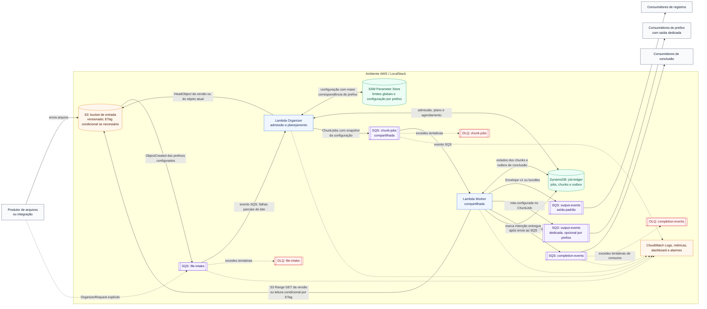

# Arquitetura do F2E

Este diagrama representa a implantação criada pelo Terraform na AWS. O fluxo
local usa os mesmos componentes emulados pelo LocalStack. As decisões de projeto
estão no [índice de ADRs](adr/README.md).

> Escopo: este é um building block inbound, de arquivo S3 para eventos SQS. Ele
> não cobre Event-to-File, SNS como destino nem ordenação global. Consulte
> [Requisitos e restrições](requisitos_e_restricoes.md) antes de adotar o fluxo.

## Leitura do fluxo

1. Um upload em um prefixo configurado do S3 gera uma notificação para
   `file-intake`. Uma integração também pode publicar um `OrganizerRequest`
   explícito nessa fila.
2. Para notificações S3, o Organizer escolhe no SSM a configuração mais
   específica para bucket e chave, valida os limites globais, fixa a identidade
   do objeto e registra no ledger a admissão e o plano. Ele publica os
   `ChunkJob`s na fila `chunk-jobs` compartilhada. Cada job carrega um snapshot
   da configuração e a rota de saída selecionada.
3. O Worker compartilhado processa chunks em paralelo, lê os intervalos
   necessários do S3 e publica registros como Envelope v1 ou, quando
   configurado, bundles. A fila `output-events` é o destino padrão; prefixos
   configurados podem ter uma fila de saída dedicada.
4. Quando o job atinge um estado terminal, o Worker reconcilia a intenção de
   conclusão persistida no ledger, envia o `CompletionEvent` para
   `completion-events` e marca a intenção como entregue após o envio. Para um
   array JSON vazio, o Organizer agenda uma mensagem de controle na fila de
   chunks para que o Worker faça essa entrega.

No catálogo Terraform atual, `example-json/` usa uma fila de saída dedicada;
`example-text/` e `example-multi-line/` usam a fila padrão. A configuração da
suíte local em `automacao/localstack/init-aws.sh` usa bundles de até três
envelopes e `recordsPerChunk` igual a 100 para os três exemplos.

## Garantias e recuperação

- O ledger é compartilhado entre prefixos, assim como a fila de chunks e a
  concorrência máxima do Worker. Um pico de um prefixo pode atrasar os demais.
  Uma fila de saída dedicada isola somente o destino dos registros daquele
  prefixo; não cria capacidade de processamento independente.
- As filas de intake e chunks têm DLQs e as Lambdas usam
  `ReportBatchItemFailures` para repetir apenas as mensagens do lote que
  falharam. A fila de conclusão também tem DLQ para falhas de consumo. O
  provisionamento atual não cria DLQ para as filas de saída dos registros:
  consumidores devem definir sua política de falha e redrive.
- A entrega de registros e de eventos de conclusão é *at-least-once*.
  Consumidores devem deduplicar registros pelo `eventId` durante retries e
  pelo `sourceRecordId` entre replays. Um envio de conclusão confirmado no SQS
  seguido de falha antes da marcação no ledger pode reenviar o mesmo `eventId`.
- O evento de conclusão sinaliza o estado terminal do job, mas não confirma que
  os consumidores já processaram todos os eventos de registro. As filas SQS
  Standard também não preservam ordem global entre chunks.

## Código e infraestrutura relacionados

- `cmd/organizer` e `internal/application/organizer`: entrada, seleção de
  configuração, admissão, planejamento e publicação de chunks.
- `cmd/worker` e `internal/application/worker`: leitura, parsing, publicação de
  registros e entrega da outbox de conclusão.
- `internal/platform/aws/ledger.go`: estados e intenção durável de conclusão.
- `terraform/s3.tf`, `terraform/ssm.tf`, `terraform/sqs.tf` e
  `terraform/lambda.tf`: entrada, configuração, filas e gatilhos.
- `terraform/dynamodb.tf` e `terraform/monitoring.tf`: ledger e observabilidade.
