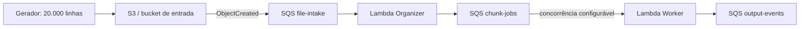

# Plano de execução do MVP F2E

## 1. Objetivo

Construir e validar localmente, em Go, a primeira versão do F2E (File-to-Events), que transforma um arquivo de registros de largura fixa armazenado no S3 em mensagens publicadas em uma fila SQS de saída.

O fluxo obrigatório do MVP é:



Este plano foi escrito para execução sequencial por agentes no VS Code usando Codex ou GitHub Copilot. Cada etapa deve terminar com código, testes e evidências reproduzíveis antes que a próxima seja iniciada.

## 2. Decisões fechadas para a primeira versão

- Linguagem: Go.
- Entrada: eventos `ObjectCreated` do S3 entregues primeiro à fila SQS `file-intake`.
- O Organizer é acionado pela fila `file-intake`, consulta metadados do objeto e cria jobs de chunks.
- A fila `chunk-jobs` desacopla o Organizer dos Workers.
- O Worker é acionado por `chunk-jobs`; múltiplas instâncias podem processar chunks em paralelo.
- A saída é publicada em uma fila SQS `output-events` usando `SendMessageBatch`.
- O arquivo inicial possui registros de largura fixa e uma linha por registro.
- O acesso ao arquivo usa somente `bucket` e `key` com SDK da AWS.
- URL pré-assinada não faz parte do MVP.
- Terraform e implantação real na AWS não fazem parte deste plano; serão tratados posteriormente.
- O ambiente local usa LocalStack e deve ser operado exclusivamente por scripts versionados.
- O processamento assume entrega `at-least-once`; IDs determinísticos devem permitir deduplicação downstream.
- Não há garantia de ordenação global entre chunks.
- Não implementar nesta versão: Step Functions, checkpoint avançado, banco de estado, formatos CSV/JSON/XML, arquivo compactado ou regra de negócio específica.

## 3. Estrutura alvo do repositório

```text
.
├── cmd/
│   ├── organizer/
│   └── worker/
├── internal/
│   ├── contracts/
│   ├── organizer/
│   ├── worker/
│   ├── fixedwidth/
│   ├── awsclient/
│   └── observability/
├── test/
│   ├── integration/
│   └── fixtures/
├── documentacao/
│   ├── plano_execucao_f2e.md
│   ├── contratos.md
│   └── operacao_local.md
├── automacao/
│   ├── docker-compose.yml
│   ├── localstack/
│   │   └── init-aws.sh
│   ├── gerar-arquivo.sh
│   ├── subir-ambiente.sh
│   ├── executar-fluxo.sh
│   ├── validar-fluxo.sh
│   └── parar-ambiente.sh
├── go.mod
└── README.md
```

Todos os scripts, arquivos do Docker/LocalStack, massas geradas e auxiliares de execução local devem ficar em `automacao`. Código Go de produção e testes permanecem fora dessa pasta.

## 4. Contratos mínimos

### 4.1 Mensagem da fila `file-intake`

O Organizer deve aceitar o envelope real de notificação S3 entregue por SQS. O parser deve suportar vários `Records` no mesmo envelope, decodificar a chave do objeto e ignorar eventos que não sejam de criação.

Campos relevantes por registro:

```json
{
  "eventName": "ObjectCreated:Put",
  "s3": {
    "bucket": { "name": "f2e-input" },
    "object": {
      "key": "input/sample-fixed-width.txt",
      "size": 2000000,
      "eTag": "...",
      "sequencer": "..."
    }
  }
}
```

### 4.2 Job da fila `chunk-jobs`

```json
{
  "schemaVersion": "1",
  "jobId": "sha256(bucket/key/version-or-etag)",
  "fileId": "sha256(bucket/key/version-or-etag)",
  "chunkId": "00000001",
  "bucket": "f2e-input",
  "key": "input/sample-fixed-width.txt",
  "etag": "...",
  "startRecord": 0,
  "recordCount": 1000,
  "recordLengthBytes": 100,
  "startByte": 0,
  "endByteInclusive": 99999
}
```

O cálculo de offsets deve considerar explicitamente o terminador de linha usado pelo gerador. Para eliminar ambiguidade no MVP, gerar sempre LF (`\n`) e definir `recordLengthBytes` como o tamanho total em bytes, incluindo LF. Validar encoding UTF-8 com conteúdo ASCII na massa inicial.

### 4.3 Evento da fila `output-events`

```json
{
  "schemaVersion": "1",
  "eventId": "sha256(fileId/chunkId/recordNumber)",
  "fileId": "...",
  "jobId": "...",
  "chunkId": "00000001",
  "recordNumber": 1,
  "byteOffset": 0,
  "payload": {
    "raw": "conteudo-do-registro-sem-LF"
  }
}
```

O corpo individual deve respeitar o limite do SQS. O publisher deve formar lotes de no máximo 10 mensagens e verificar falhas parciais retornadas pelo serviço.

## 5. Plano de implementação para agentes

### Passo 1 — Preparar o projeto e registrar decisões

**Objetivo:** criar o esqueleto compilável e impedir divergências arquiteturais.

**Tarefas do agente:**

1. Inicializar o módulo Go e criar os diretórios da estrutura alvo.
2. Definir uma versão mínima de Go suportada e registrá-la no `README.md`.
3. Criar configuração central por variáveis de ambiente: endpoint AWS, região, nomes das filas, bucket, tamanho do registro, registros por chunk, batch e concorrência.
4. Criar `documentacao/contratos.md` com os contratos versionados do item 4 e exemplos completos de envelopes.

**Aceite:** `go test ./...` e `go build ./cmd/...` executam com sucesso em uma máquina limpa com Go instalado.

### Passo 2 — Criar o ambiente LocalStack reproduzível

**Objetivo:** disponibilizar localmente S3, SQS e Lambda sem configuração manual no console.

**Tarefas do agente:**

1. Criar `automacao/docker-compose.yml` com versão de imagem fixada e serviços S3, SQS, Lambda, CloudWatch Logs e IAM necessários ao fluxo.
2. Criar `automacao/localstack/init-aws.sh` idempotente para provisionar:
   - bucket `f2e-input`;
   - fila `file-intake` e sua DLQ;
   - fila `chunk-jobs` e sua DLQ;
   - fila `output-events` e sua DLQ;
   - políticas de redrive;
   - notificação `s3:ObjectCreated:*` do bucket para `file-intake`;
   - Lambdas Organizer e Worker;
   - event source mappings SQS → Lambda;
   - permissões locais necessárias.
3. Configurar visibilidade das filas acima do timeout da Lambda e limitar a concorrência do Worker por variável/configuração.
4. Criar scripts shell para subir, aguardar health check e parar o ambiente.
5. Fazer os scripts falharem cedo quando Docker, Go, AWS CLI ou `awslocal` requerido não estiver disponível.

**Aceite:** após subir o ambiente duas vezes, a segunda execução continua bem-sucedida e `awslocal` lista exatamente os recursos esperados, sem duplicação.

### Passo 3 — Implementar contratos e adaptadores AWS

**Objetivo:** isolar detalhes do SDK e tornar as regras testáveis sem LocalStack.

**Tarefas do agente:**

1. Modelar envelopes externos em `internal/adapter/inbound` e mensagens centrais (`ChunkJob` e `OutputEvent`) em `internal/domain/f2e`.
2. Criar interfaces mínimas para `HeadObject`, leitura por range e publicação SQS.
3. Implementar adaptadores com AWS SDK for Go v2, permitindo endpoint customizado e path-style S3 no LocalStack.
4. Inicializar configuração e clientes fora dos handlers para reaproveitamento em invocações quentes.
5. Padronizar erros com contexto, sem registrar conteúdo integral do arquivo ou credenciais.

**Aceite:** testes unitários cobrem serialização, chaves S3 com espaços/caracteres escapados, configuração local e falhas do SDK.

### Passo 4 — Implementar a Lambda Organizer

**Objetivo:** converter cada objeto criado em jobs determinísticos de chunks.

**Tarefas do agente:**

1. Receber eventos SQS e extrair todos os `Records` de S3 válidos.
2. Usar `HeadObject` para confirmar tamanho e ETag; rejeitar objeto vazio ou incompatível com o tamanho fixo configurado.
3. Calcular chunks por quantidade de registros, sem sobreposição nem lacunas.
4. Gerar `fileId`, `jobId` e `chunkId` determinísticos.
5. Publicar jobs em lotes na fila `chunk-jobs`, tratando falhas parciais.
6. Retornar resposta de partial batch failure para que somente mensagens SQS com falha sejam reenviadas.
7. Produzir logs JSON com IDs, bucket, key, bytes, registros e quantidade de chunks.

**Aceite:** testes de tabela provam os casos de zero, um, múltiplos e último chunk parcial; a soma dos ranges cobre o arquivo uma única vez.

### Passo 5 — Implementar leitura e parsing de largura fixa

**Objetivo:** ler somente o range atribuído ao Worker e emitir registros incrementalmente.

**Tarefas do agente:**

1. Fazer `GetObject` com `Range: bytes=start-end`.
2. Ler em streaming com buffer limitado; não usar `io.ReadAll` para o chunk.
3. Validar o número exato de bytes e registros recebidos.
4. Remover apenas o LF final de cada registro e rejeitar registros de tamanho inesperado.
5. Expor iterador/callback para que o publisher possa montar lotes sem armazenar o chunk inteiro.
6. Honrar cancelamento e deadline do `context.Context`.

**Aceite:** testes com readers pequenos e fragmentados validam boundaries, último chunk parcial, leitura curta, LF inválido e consumo limitado de memória.

### Passo 6 — Implementar a Lambda Worker e paralelismo

**Objetivo:** processar chunks independentemente e publicar todos os registros em `output-events`.

**Tarefas do agente:**

1. Consumir cada `ChunkJob`, validar `schemaVersion` e invariantes de range.
2. Ler e converter registros em `OutputEvent`, preservando rastreabilidade.
3. Publicar lotes SQS com no máximo 10 mensagens e retry limitado para falhas parciais recuperáveis.
4. Não confirmar o job quando qualquer registro do chunk não tiver sido publicado com sucesso.
5. Suportar várias mensagens por invocação e limitar concorrência interna; o paralelismo principal deve vir do event source mapping/Lambda.
6. Retornar partial batch failure e emitir logs JSON e métricas simples de duração, bytes e registros.
7. Documentar que duplicatas podem ocorrer após falha parcial, sendo `eventId` o identificador de deduplicação.

**Aceite:** testes demonstram batch 10+10+restante, retry parcial, propagação de cancelamento, IDs estáveis e dois chunks processáveis fora de ordem sem corromper os resultados.

### Passo 7 — Criar o gerador determinístico de 20.000 linhas

**Objetivo:** produzir uma massa repetível que permita provar completude e integridade.

**Tarefas do agente:**

1. Criar versões shell em `automacao`, com os mesmos argumentos e resultado lógico.
2. Gerar por padrão `automacao/dados/entrada-20000.txt`, exatamente 20.000 registros, ASCII/UTF-8, LF e largura total configurada.
3. Incluir número sequencial com zero à esquerda e payload determinístico em cada registro.
4. Gerar um manifesto JSON com quantidade, largura, tamanho em bytes e SHA-256.
5. Recusar sobrescrita silenciosa, exceto com opção explícita `--force`/`-Force`.

**Aceite:** scripts validam 20.000 LF, tamanho esperado, unicidade das sequências e hash reproduzível entre execuções equivalentes.

### Passo 8 — Automatizar o fluxo local ponta a ponta

**Objetivo:** executar toda a demonstração com um único comando depois que o ambiente estiver saudável.

**Tarefas do agente:**

1. Criar `executar-fluxo.sh` para:
   - limpar somente mensagens/objetos da execução anterior por meio das APIs locais;
   - gerar a massa quando ausente;
   - fazer upload para `s3://f2e-input/input/entrada-20000.txt`;
   - aguardar, com timeout e polling curto, o esvaziamento de `file-intake` e `chunk-jobs`;
   - aguardar 20.000 mensagens disponíveis/produzidas em `output-events`.
2. Criar scripts de validação que consumam a saída para um diretório temporário em `automacao/resultados`, sem depender da ordem global.
3. Verificar quantidade, unicidade de `eventId`, cobertura de `recordNumber` 1..20000, `fileId`, payload e ausência de mensagens nas DLQs.
4. Imprimir resumo final com duração, chunks, registros, duplicatas, faltantes e erros.
5. Retornar código diferente de zero em timeout ou divergência.

**Aceite:** um único comando produz a confirmação `20.000/20.000`, nenhuma lacuna, nenhuma DLQ e nenhum erro; executar novamente também termina corretamente, isolando cada rodada.

### Passo 9 — Testes de robustez e observabilidade

**Objetivo:** comprovar os comportamentos essenciais do modelo `at-least-once`.

**Tarefas do agente:**

1. Adicionar testes de integração para arquivo vazio, tamanho inválido, objeto inexistente, chunk duplicado e indisponibilidade temporária da fila de saída.
2. Confirmar redrive para DLQ após o número configurado de tentativas.
3. Confirmar que o reenvio do mesmo job gera os mesmos IDs.
4. Executar Workers com concorrência maior que 1 e provar completude independentemente da ordem.
5. Medir pico aproximado de memória e tempo total do arquivo de 20.000 linhas; registrar os resultados como baseline, sem prometer performance de AWS real.

**Aceite:** relatório de integração registra comandos, resultados, limitações do LocalStack e evidências dos cenários de erro.

### Passo 10 — Documentar operação e preparar o handoff

**Objetivo:** permitir que outra pessoa reproduza o MVP sem conhecimento prévio.

**Tarefas do agente:**

1. Atualizar `README.md` com pré-requisitos e o caminho rápido.
2. Criar `documentacao/operacao_local.md` com configuração, troubleshooting, inspeção de filas/logs e limpeza segura.
3. Registrar variáveis, valores padrão e relação entre timeout e visibility timeout.
4. Registrar limitações do MVP e itens explicitamente adiados para AWS/Terraform.
5. Rodar build, testes unitários, integração e fluxo completo a partir de checkout limpo.

**Aceite:** um segundo agente segue apenas a documentação e obtém o resultado `20.000/20.000`.

## 6. Ordem, dependências e divisão entre agentes

Os passos devem ser executados na ordem abaixo. Agentes podem trabalhar em paralelo somente quando as dependências estiverem estabilizadas:

| Onda | Passos | Pode paralelizar? | Dependência |
|---|---|---:|---|
| 1 | 1 | Não | Nenhuma |
| 2 | 2 e 3 | Sim | Estrutura e configuração do passo 1 |
| 3 | 4 e 5 | Sim | Contratos e interfaces do passo 3 |
| 4 | 6 e 7 | Sim | Contratos; Worker depende também do passo 5 |
| 5 | 8 | Não | Organizer, Worker, LocalStack e gerador funcionais |
| 6 | 9 e 10 | Parcialmente | Fluxo ponta a ponta funcional |

Ao transferir trabalho entre agentes, incluir no prompt: passo exato, arquivos permitidos, contratos já aprovados, comando de validação e proibição de alterar decisões do item 2. O agente deve informar arquivos alterados, testes executados e riscos restantes.

## 7. Guardrails de implementação

- Não misturar criação futura de infraestrutura AWS com o ambiente LocalStack.
- Não adicionar URL pré-assinada “para deixar preparado”.
- Não substituir a fila de entrada por invocação direta S3 → Lambda.
- Não carregar arquivo ou chunk completo em memória.
- Não usar concorrência ilimitada nem criar uma goroutine por registro.
- Não assumir exatamente uma notificação S3 por mensagem SQS.
- Não considerar sucesso quando `SendMessageBatch` retorna itens em `Failed`.
- Não usar timestamps aleatórios nos IDs de rastreabilidade.
- Não depender da ordem de entrega das filas Standard.
- Não esconder falhas nos scripts; todo script deve propagar código de saída.
- Fixar versões de imagens e dependências relevantes para reprodução.

## 8. Definição de pronto do MVP

O MVP estará pronto quando, a partir de checkout limpo e usando apenas comandos documentados:

1. O LocalStack subir e provisionar todos os recursos automaticamente.
2. O gerador criar exatamente 20.000 registros válidos e um manifesto verificável.
3. O upload ao S3 produzir a mensagem na fila `file-intake` por notificação `ObjectCreated`.
4. O Organizer produzir todos os jobs na `chunk-jobs`, sem lacunas ou sobreposição.
5. Workers executarem em paralelo, lendo ranges e publicando em batches.
6. A fila `output-events` receber 20.000 eventos rastreáveis.
7. A validação provar cobertura total, IDs determinísticos, payload correto e DLQs vazias.
8. Build, testes unitários e testes de integração passarem.
9. A operação local completa estiver documentada e automatizada em shell.

## 9. Itens para a etapa futura de AWS

Somente depois da validação local deverão ser planejados: módulos Terraform, buckets e filas reais, empacotamento/deploy, IAM de menor privilégio, criptografia/KMS, alarmes CloudWatch, reserved concurrency, sizing, custos, arquitetura arm64/x86_64, políticas de retenção e pipeline CI/CD. Esses itens não devem bloquear nem contaminar o MVP local.
